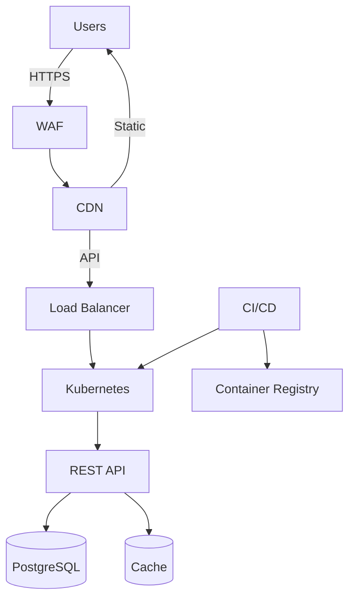
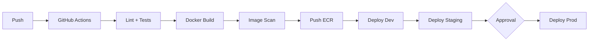

# Innovate Inc. - Cloud Architecture

This document describes the proposed cloud infrastructure for Innovate Inc.'s web application - a Flask REST API with a React frontend and PostgreSQL database. The primary design targets AWS, but I've included a GCP alternative in the last section since it's worth an honest look.

Editable diagrams: [aws-architecture](./aws-arch.drawio) | [gcp-architecture](./gcp-arch.drawio)

---

## 1. High-Level Overview

Before diving into details, here's the big picture of what we're building:

In short: users hit a CDN edge, static React assets are served from object storage, API calls are forwarded through a load balancer into a Kubernetes cluster running the Flask backend, and data lives in managed PostgreSQL. Nothing fancy - just solid, proven building blocks.

---

## 2. AWS Accounts

I'd recommend starting with three AWS accounts under Organizations:

- **Management** - the org root. Handles billing, SCPs, and SSO via IAM Identity Center.
- **Shared Services** - ECR container registry, CI/CD IAM roles, centralized logging, Route 53 DNS. Things that don't belong to one environment.
- **Production** - the live workloads with strict change controls.

Why separate accounts instead of just one? Mainly blast radius - a misconfigured IAM policy in a dev sandbox can't accidentally touch prod resources. You also get per-account billing out of the box, which is nice for cost tracking.

Down the road, add **Dev** and **Staging** accounts when the team grows. No rush - three is fine for now.

---

## 3. Network

Each account gets its own VPC in `eu-central-1`, spread across three availability zones. The subnet layout is straightforward:

| Subnet tier | What goes here | Internet access |
| - | - | - |
| **Public** (×3 AZs) | ALB, NAT Gateway | Direct via IGW |
| **Private** (×3 AZs) | EKS nodes, application pods | Outbound only, through NAT |
| **Data** (×3 AZs) | RDS, ElastiCache | None - fully isolated |

For security, the approach is defense in depth: AWS WAF sits on CloudFront with OWASP managed rules and rate limiting. Security groups chain tightly - CloudFront prefix list → ALB → EKS nodes → RDS on port 5432 only. No shortcuts. VPC Flow Logs are on everywhere for auditability, and we use VPC endpoints for ECR, S3, and STS to keep that traffic off the public internet (also saves on NAT costs). TLS is enforced end to end.

---

## 4. Compute - EKS with Karpenter

The EKS cluster lives in private subnets. The API endpoint is locked down to CI/CD NAT IPs and the team's VPN CIDR - no open-to-the-world control plane.

For nodes, I'd set up two tiers:

- **System nodes** - a small managed node group of 2× `t4g.medium` (Graviton). These run Karpenter itself, CoreDNS, and monitoring agents. Kept separate so cluster operations don't compete with app workloads.
- **Application nodes** - fully managed by Karpenter. It picks from `c7g`, `m7g`, and `r7g` families (all Graviton/Arm) and right-sizes based on what pods actually need. New nodes come up in about 60 seconds, and idle ones get consolidated within 30s. Spot instances are enabled here since Flask API pods are stateless and can tolerate interruptions.

Pod scaling uses a standard HPA - target 60% CPU on the Flask deployment, minimum 2 replicas. Karpenter handles the node layer automatically underneath.

On the container side: GitHub Actions builds multi-arch images (`amd64` + `arm64`) so we can run on Graviton without worrying about compatibility. Images go to ECR, and deploys happen via Helm with rolling updates and readiness probes. Nothing exotic.

---

## 5. Frontend - S3 + CloudFront

The React SPA doesn't need to run inside Kubernetes - it's just static files. CI runs `npm run build`, uploads the output to a private S3 bucket, and CloudFront serves it at the edge with TLS via ACM.

API calls (`/api/*`) get routed by CloudFront to the ALB as a second origin. This way the SPA and API share the same domain, which avoids CORS headaches.

The cost for hosting the frontend like this is practically zero.

---

## 6. Database

I'd go with **RDS PostgreSQL Multi-AZ** to start. Aurora is tempting, but at low traffic it's more expensive (minimum 2 instances) and we don't need its scaling features yet. The nice thing is that RDS and Aurora PostgreSQL are wire-compatible, so migrating later is essentially a snapshot restore - not a big deal.

What we get out of the box:

- Automated daily snapshots with 14-day retention, plus continuous WAL archiving for point-in-time recovery to any second.
- Multi-AZ standby that failovers in under 60 seconds if the primary goes down.
- Cross-region snapshot copy to `eu-west-1` for regional DR (cheap insurance).
- Encryption at rest with a KMS CMK and enforced SSL for connections.

As traffic grows: first add read replicas for read-heavy queries, then consider migrating to Aurora when you actually need auto-scaling storage and 15+ replicas.

---

## 7. Security

The application stores user data, so standard production security controls apply.

Here's the approach:

**Access control** - humans authenticate through IAM Identity Center (SSO), not long-lived IAM keys. Pods get AWS permissions via EKS Pod Identity, scoped to exactly what each workload needs.

**Secrets** - database credentials, API keys, etc. live in Secrets Manager. They're synced into Kubernetes via External Secrets Operator so app code just reads them from the usual k8s secret mount.

**Container hardening** - ECR scans images on push. Pods run as non-root with a read-only root filesystem. Pod Security Standards are set to "restricted" at the namespace level.

**Encryption** - KMS customer-managed keys for everything at rest (RDS, S3, EBS, ECR). TLS in transit, no exceptions.

**Audit trail** - CloudTrail logs all AWS API calls, VPC Flow Logs capture network traffic, and EKS audit logs track who did what in the cluster. GuardDuty runs on top for anomaly detection.

---

## 8. CI/CD

The deployment pipeline runs on GitHub Actions:

Each commit builds a multi-arch Docker image tagged with the git SHA. After tests pass and the image scan looks clean, it rolls out to dev automatically. Staging deploys are automatic too, but production requires a manual approval gate - someone has to click "approve" before it goes live.

Deploys use Helm with rolling updates, so there's zero downtime. If something breaks, `helm rollback` gets you back in seconds, or you can just revert the commit and let the pipeline redeploy.

---

## 9. Monitoring

Observability stack is fairly standard:

- **Metrics** - Prometheus scrapes cluster and app metrics, Grafana for dashboards. Covers pod resources, HPA status, Karpenter activity, RDS CloudWatch metrics.
- **Logs** - Fluent Bit ships container logs to CloudWatch Logs. Structured JSON format so they're actually searchable.
- **Traces** - OpenTelemetry (or X-Ray) for request tracing across services.
- **Alerts** - Grafana alerting rules fire through SNS to Slack or PagerDuty. The usual suspects: pod crash loops, high error rates, DB connection saturation, node pressure.

---

## 10. Cost Considerations

A few things that keep the bill reasonable:

- **Graviton instances** save about 20% vs. equivalent x86 - and performance is comparable or better for most workloads.
- **Spot instances** for stateless API pods can cut compute costs by up to 70%. Flask pods are stateless by design, so Spot interruptions are fine.
- **Karpenter consolidation** continually repacks workloads and shuts down underused nodes. Karpenter consolidation improves bin-packing and reduces spend on underutilized nodes.
- **S3 + CloudFront** for the SPA means we're not running pods just to serve static files.
- **One NAT Gateway** to start (~$30/mo) instead of three. Move to per-AZ NAT Gateways later if you need HA on the egress path.

Rough launch cost: ~$300/month depending on traffic. That includes the EKS control plane ($73), two Graviton nodes (~$50), RDS Multi-AZ (~$25), NAT Gateway (~$30), and miscellaneous bits.

---

## 11. Growth Plan

The architecture is designed to evolve without major rework:

- **Launch** (hundreds of users/day) - single EKS cluster, RDS Multi-AZ, 2 system nodes, Karpenter handling app nodes. Keep it simple.
- **Growth** (thousands/day) - add an RDS read replica, lean into Spot for API pods, spin up a Staging account for proper pre-prod testing.
- **Scale** (millions/day) - migrate to Aurora PostgreSQL for auto-scaling reads, add ElastiCache for session offload, move to per-AZ NAT Gateways, and consider multi-region if latency demands it (CloudFront already handles the edge).

---

## 12. GCP Alternative - GKE Autopilot

I want to be honest: if minimizing operational overhead is the top priority, GKE Autopilot deserves serious consideration. Here's how it compares.

**Cost at launch:**

| | GKE Autopilot | EKS + Karpenter |
| - | - | - |
| Control plane | $0 | $73/mo |
| Compute | ~$15–20/mo (pod-level billing) | ~$50–70/mo (node-level billing) |
| DB + NAT + LB | ~$78/mo | ~$80/mo |
| **Total** | **~$95–105/mo** | **~$205–230/mo** |

That's roughly half the cost at launch. The catch is that at higher scale (100+ pods), Autopilot's pod billing carries a 30–40% premium over raw VMs, so EKS with Spot Graviton and bin-packing ends up cheaper.

**The real trade-off is flexibility vs. simplicity:**

GKE Autopilot gives you zero node management - Google handles provisioning, scaling, OS patching, all of it. You just deploy pods. But you lose some control: no DaemonSets, no privileged pods, limited Arm instance types (Tau T2A only), and less Spot coverage.

EKS + Karpenter gives you full control over nodes, networking, and security policies. The Graviton instance selection is wider, and the Spot pool is deeper. But you own the configuration - it's not hard with Karpenter, but it's not zero either.

**My recommendation:** this document builds around **AWS (EKS + Karpenter)** because it scales better economically, offers full flexibility, and has a larger hiring pool for AWS skills. The Terraform code in this repo deploys the entire stack.

That said, if the team is small (say, under 5 people), there's no dedicated infra person, and the $100/mo vs $230/mo difference matters at launch - GKE Autopilot is genuinely the smarter starting point. The application itself doesn't depend on cloud-specific SDKs, so moving later would mostly be an infrastructure and deployment migration rather than a backend/frontend rewrite.

## 13. Known limitations

- **Single NAT Gateway** - acceptable cost optimization at launch, but introduces an AZ-level egress single-point of failure.
- **EKS control plane cost** - relatively expensive at small scale compared to GKE Autopilot or ECS.
- **Spot interruptions** - acceptable for stateless API workloads, but may cause short-lived latency spikes during node replacement.
